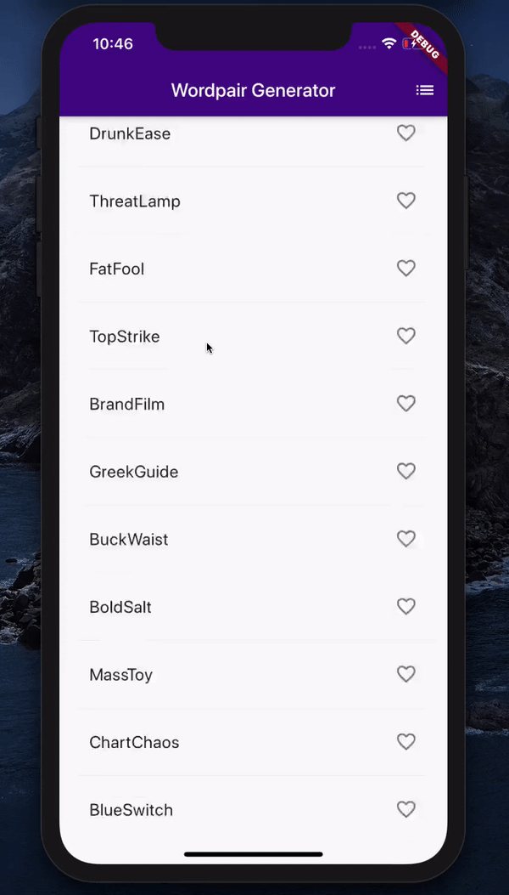

# Playground
#### Purpose 
To play around, test, and learn Flutter and Firebase.
#### Approach
Each branch of this repo will represent a different application that was completed either through a tutorial or personal exploration. The branch will contain the detailed commits that led to the completion of the app. Once the app is completed, it will be added to the `master` branch in one push. More details on the applications can be found below.
#### Applications
- branch: `wordpairGeneratorApp`
   - _What_: List random word pairs using the dart package `english_words` and display favourite word pairs.
   - _Tutorial:_ [Flutter Crash Course](https://www.youtube.com/watch?v=1gDhl4leEzA) from TraversyMedia.
     > 
- branch: `bottomNavigationApp`
  - _What_: Implement a bottom navigation that changes the screen colour depending on the page selected.
  - _Tutorial_: [How to use Flutter to build an app with bottom navigation](https://willowtreeapps.com/ideas/how-to-use-flutter-to-build-an-app-with-bottom-navigation) from Joseph Cherry
    > 
  
